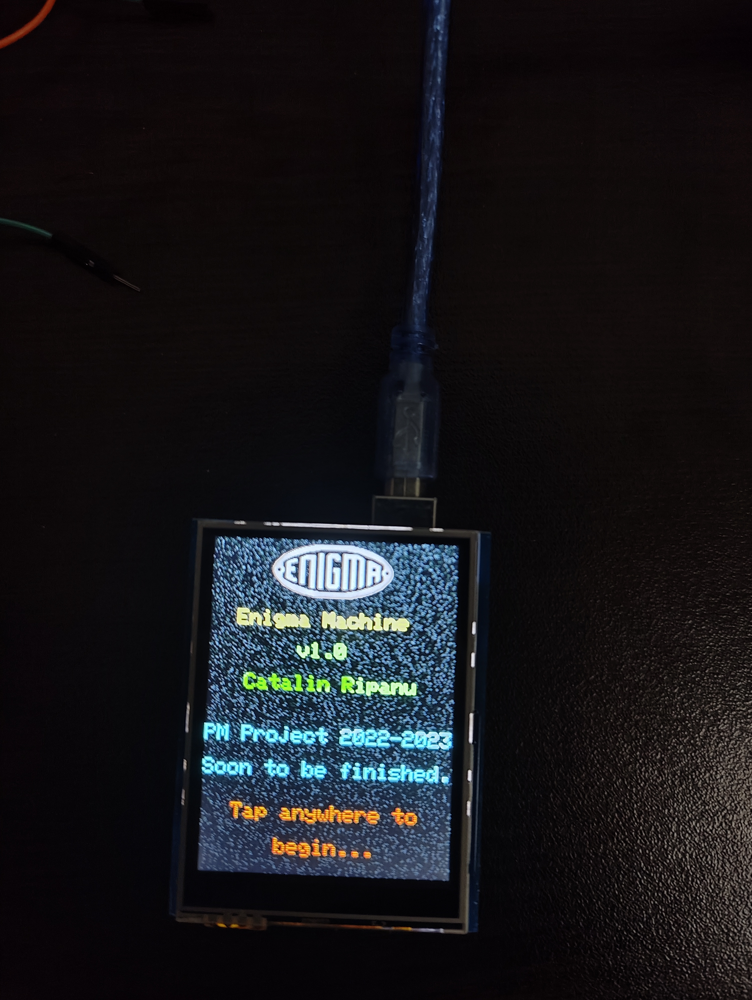
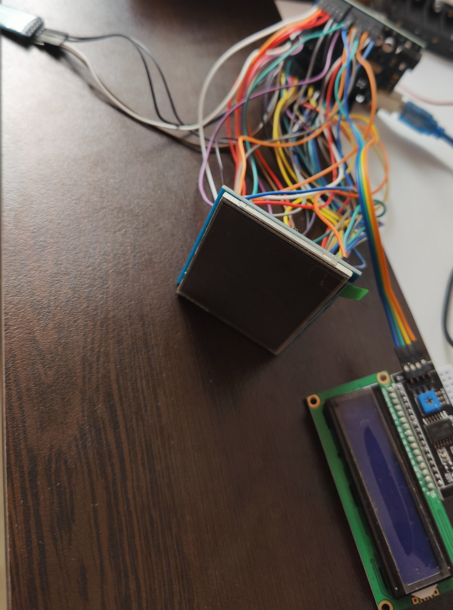

# Mini Enigma Machine

**Author:** Cătălin-Alexandru Rîpanu (3rd year)

## Introduction

### What does it do?

The Enigma Machine is an electro-mechanical unit based on Morse code with cryptographic support that was implemented and used by Nazi Germany to transmit critical encrypted messages using a complex algorithm that was believed to be unbreakable (unbeatable), based on plugboard and rotors.

This project consists of implementing and designing a new Enigma machine model that involves functionalities already existing in the classic version and new functionalities that facilitate the transmission of plain text messages via Bluetooth, and their return, by the machine, in the encrypted version.

### Project Purpose and Utility

This theme aims to showcase the technical creativity demonstrated by engineers in Nazi Germany when they designed, around 1918, the encryption algorithm based on the physical components of the machine, such as lamps and rotors. Moreover, this project could be part of the study of creating a new algorithm, possibly quantum or cryptographic, that extends the current one, using classic techniques or from the Quantum paradigm.

### Initial Idea

Initially, I wanted to understand and analyze more about how the Enigma algorithm works, so I decided to implement my own version to accomplish this. Also, I read certain documentation based on this topic that explained, clearly and concisely, the mathematical foundations that underlie the logic of the entire algorithm, so the desire to approach this project was amplified.

## General Description

After starting and initializing the Enigma, initially, the user will be able to choose between 2 encryption modes: encryption using the graphical interface and encryption using message transmission via Bluetooth. Regardless of the chosen variant, the machine will return the same result, namely the encrypted message.

Using a TFT LCD display (touchscreen) compatible with the Arduino UNO board, which also includes a slot for an SD card, a graphical interface will be exposed that will simulate the central unit / central control panel with all the components related to the classic version (lamps, keyboard, rotors, etc.).

This machine variant represents, in essence, a portable version of the real machine that fulfills the same role that ensures the raising of the security level within a communication that is established between 2 entities.

## Block Diagram


## Hardware Design

- Arduino UNO R3
- Adafruit TFT 2.8" LCD Display
- Male/female jumper wires
- HC-05 Bluetooth Module
- I2C Module for LCD 1602
- Mini Breadboard
- 9V Battery Socket
- 9V Battery
- Case
- LCD 1602

## Electrical Schematic


## Project Initialization




## Software Design

The project software was made using the Arduino IDE development environment, version 2.1.0.
The libraries used in the project are the following:

```Arduino
#include <SPI.h>              // to be able to communicate and operate with the TFT TouchScreen LCD.
#include <LiquidCrystal_I2C.h>  // to be able to manipulate the I2C module that handled the 1602 LCD.
#include <Adafruit_ILI9341.h>   // to be able to perform data transfer to/from the TFT LCD (interfacing).
#include <Adafruit_STMPE610.h>  // to be able to read from chip the coordinates (x,y) of the pressed area.
#include <Adafruit_GFX.h>       // to be able to create and display graphic objects/artifacts intended for the TFT LCD.
```

## Operation

### 1. Start-up:
- from the start screen, you can touch the TFT LCD anywhere to go to the Enigma simulation.
- the simulation starts with the M3 Enigma standard (1939) that uses reflector B, along with standard wheels III, II, and I.
- the mounted wheels have the rings set in the default positions, without having wires connected to the plugboard (bottom part).
- to change the architecture of the current machine, you can press the logo in the top right. The configuration page will be displayed.
- to delete the output data, press on the tape.
- to modify the rotor letters, you can press on the upper/lower part of the respective rotor. The upper part displays the letter that comes before the current letter (alphabetical order), and the lower part displays the letter that comes after the current letter (alphabetical order).

### 2. Configuration:
- the simulator allows the following standard configurations:

#### 1. Standard M3 1939
   1. Machine Type: Enigma M3 (1939)
   2. Reflector: B
   3. Group length: 5
   4. Wheels: III II I
   5. Rings: 01 01 01
   6. Wires: (no wires)

#### 2. Rocket K Railway
   1. Machine Type: Enigma Rocket K Railway
   2. Reflector: A
   3. Group length: 5
   4. Wheels: III II I
   5. Rings: 01 01 01 01
   6. Wires: (no plugboard)

#### 3. Turing Rocket K 1940
   1. Machine Type: Enigma Rocket K Railway
   2. Reflector: A
   3. Group length: 5
   4. Wheels: III I II
   5. Rings: 26 17 16 13
   6. Wires: (no plugboard)

#### 4. Barbarosa M3 1941
   1. Machine Type: Enigma M3 (1939)
   2. Reflector: B
   3. Group length: 5
   4. Wheels: II IV V
   5. Rings: 02 21 12
   6. Wires: AV BS CG DL FU HZ IN KM OW RX

#### 5. Standard M4 1942
   1. Machine Type: Enigma M4 (1942)
   2. Reflector: Thin B
   3. Group length: 4
   4. Wheels: B III II I
   5. Rings: 01 01 01 01
   6. Wires: (no wires)

#### 6. Scharnhorst M3 1943
   1. Machine Type: Enigma M3 (1939)
   2. Reflector: B
   3. Group length: 5
   4. Wheels: III VI VIII
   5. Rings: 01 08 13
   6. Wires: AN EZ HK IJ LR MQ OT PV SW UX

- to select a specific configuration, you can press the "Quick Setup" button. Each press will advance in the list.
- when you reach the desired configuration, it can be loaded by pressing the "LOAD" button. Attention, this button only displays the configuration, it does not make it active.
- obviously, to set a certain component (wire, ring, wheel, etc.) you must press the blue area next to the respective component (each press will display the next supported element from the list).
- the group (tape) refers to the separation of encrypted/decrypted letters into groups that have the configurable length from the interface.
- to be able to activate a mode setting, press the "ACTIVATE" button. Obviously, to give up the new setting and keep the old setting, press the "DISCARD" button.
- letters connected by wires will be colored in purple and, for each letter, its pair will be displayed (at the bottom of the respective letter).

### 3. Bluetooth
- this simulator also supports operation with the Bluetooth communication protocol.
- after leaving the configuration page, a new page will be displayed requesting the choice of an operating mode (classic or Bluetooth).
- if the classic variant is chosen, the machine can receive input data only through the keyboard.
- if the Bluetooth variant is chosen, the machine can also receive data through the serial interface that is used by any Bluetooth application for Android (the Serial Bluetooth Terminal 1.43 application available on Play Store is recommended as it was tested during project development). Connection is made using the HC-05 module.
- obviously, even in this mode, the machine can receive data through the keyboard.
- to see if Bluetooth mode is enabled, a green text ("Bluetooth") is displayed in the top left corner. If this is no longer there, it means that the classic operating mode is activated.
- if an attempt is made to transmit data via Bluetooth when this mode is disabled, the machine will not encrypt/decrypt what was entered but will keep the information in a memory area (in other words, if Bluetooth mode is activated immediately after data transmission, the machine will start the processing).
- to clean the tape via Bluetooth, use the character '*'.

## Results Obtained




## Conclusions

It was an interesting experience, obviously, considering that the project represented, in fact, a Hardware & Software duality, which requires a certain approach (libraries compatible with Hardware resources, components compatible with other components, etc.). At the beginning of the project, I changed the TFT LCD screen (I had taken a model from China) because, effectively, the graphic support libraries from Adafruit did not work. Also, the formation of the wooden box represented a problem along the way, I had a little luck towards the end as I found a carpenter who accepted the proposed work after viewing the provided technical sheet. A difficult stage was mounting all the modules in the box (I had to make some soldering so that the 1602 LCD and the I2C module would work, a known neighbor offered me his soldering gun). The most challenging part was writing the Software, in the file from the .zip archive there are approximately, around 3500 lines of code (I could not reduce this number by much, moreover, I also had problems with the compilation stage sometimes because the IDE kept telling me that I exceed the 32KB intended for Flash memory on the board, currently the implementation occupies a memory of ~ 32212 bytes out of 32256 bytes).

In the end, I am glad that I managed to obtain my own version of the Enigma machine.

## Download

For permission to access the source code, you can send a message to the email address catalin.ripanu@stud.acs.upb.ro.

## Journal

- 6.05.2023: The page for the Enigma project was posted.
- 7.05.2023: Descriptions and hardware components were updated, along with the block diagram.
- 21.05.2023: The corresponding electrical diagram was posted. Also, some pictures of the project were posted.
- 29.05.2023: Information related to the Software stage and some images with Hardware progress were posted. The project has been completed.

## Bibliography/Resources

- http://people.physik.hu-berlin.de/~palloks/js/enigma/index_en.html → The most important link, contains the application that helped me with the Design of Algorithms behind Enigma.
- https://www.stephenpeek.co.uk/enigma_machines.htm
- https://lastminuteengineers.com/i2c-lcd-arduino-tutorial/
- https://github.com/adafruit/Adafruit-GFX-Library
- https://learn.adafruit.com/adafruit-2-8-tft-touch-shield-v2/overview
- https://cdn-shop.adafruit.com/datasheets/STMPE610.pdf
- https://cdn-shop.adafruit.com/datasheets/ILI9341.pdf
- https://cdn-shop.adafruit.com/datasheets/MI0283QT-11%20V1.1.PDF
- https://ocw.cs.pub.ro/courses/pm → PM laboratories.
